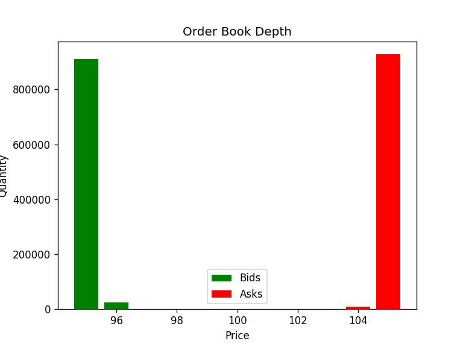

# Limit Order Book Matching Engine
A limit order book matching engine written in C++ that matches buy and sell orders by price-time priority, supports multiple order types, and processes ~2 million orders/sec (single-threaded).

## Features
- **Price-time priority** matching (best price first, then FIFO within the price level)
- **Order types:** Limit, Market, IOC (Immediate-Or-Cancel), FOK (Fill-Or-Kill)
- **Partial fills** and multi-level sweep
- **O(1) order cancellation** via an order-id index
- Automated test suite (doctest) and a throughput benchmark

## Build & Run
Requires a C++20 compiler (e.g. g++ 13+).

**Run the benchmark / driver:**
```
g++ -std=c++20 -O2 main.cpp orderbook.cpp -o app.exe
./app.exe
```
**Run the tests:**
```
g++ -std=c++20 tests.cpp orderbook.cpp -o tests.exe
./tests.exe
```
**(Optional) Generate the depth chart:**
```
python plot_book.py
```

## Design
The book keeps two sides. **Bids** and **asks** are each a `std::map` keyed by
price, asks are ascending and bids descending, so the best price on either side is
always the first element (`begin()`), giving O(1) access to the best bid/ask and
O(log n) insertion/removal of price levels. This is what enforces **price priority**.

At each price, orders are held in a `std::list` in arrival order. New orders are
appended to the back and matching consumes from the front, so the earliest order
at a price fills first — this enforces **time priority (FIFO)**.

For cancellation, an `unordered_map` maps each order id to its location:
`{ side, price, list iterator }`. Because `std::list` iterators stay valid as
other elements are added or removed, cancelling an order is O(1) by looking up at the index and erasing the element. A `std::vector` would not work here because erasing an order from the middle is O(n), and reallocation would invalidate the stored iterators the index relies on.

## Performance
Benchmarked at ~2M orders/sec (single-threaded, compiled with `-O2`, N = 1,000,000
random limit orders). This measures matching throughput, not real-market network
latency.

## Depth chart after 1M random orders
Orders near the mid-price trade away and unmatched orders accumulate at the edges of the price band (95 bids / 105 asks).



## Possible extensions
- Lower-latency data structures (object pools, intrusive lists, array-indexed price levels)
- Self-trade prevention, stop orders
- Replaying real historical market data